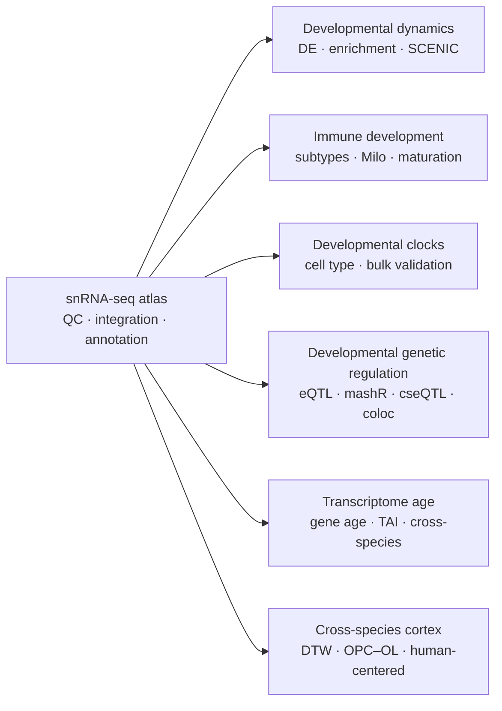

<div align="center">

# DevCellAtlas_Pigs

### A multi-tissue developmental single-nucleus transcriptomic atlas of the pig

*Analysis code accompanying a developmental atlas of* ***Sus scrofa*** *across tissues, cell types and developmental stages.*

[Overview](#overview) · [Code map](#code-map) · [Workflow](#analysis-workflow) · [Usage](#usage) · [Software](#software) · [Data](#data-availability) · [Citation](#citation)

</div>

---

## Overview

This repository contains the analysis and figure-generation code for a multi-tissue developmental single-nucleus RNA-sequencing study of the pig (*Sus scrofa*). The study spans embryonic to postnatal development and integrates cell-atlas construction, developmental transcriptional dynamics, immune maturation, transcriptomic clocks, genetic regulation, transcriptome age and cross-species cortical analyses.

|  | Study design |
|---|---|
| **Developmental stages** | E55 · E90 · P0 · P30 · P90 · P180 |
| **Tissues** | Adipose · Cerebrum · Duodenum · Heart · Hypothalamus · Liver · Skeletal muscle |
| **Primary modality** | Single-nucleus RNA sequencing |
| **Analysis themes** | Atlas · Developmental dynamics · Immune · Developmental clocks · eQTL · TAI · Cross-species |
| **Languages** | R · Python · Bash |

> **Scope.** This repository provides the analysis and figure-generation code accompanying the manuscript. Raw sequencing data and large intermediate analysis objects are distributed separately through the public data resources described in the manuscript.

---

## Analysis workflow



---

## Code map

| Module | Scope | Manuscript |
|---|---|---:|
| [`scripts/01_atlas_annotation/`](scripts/01_atlas_annotation/) | Quality control, AnnData construction, scVI integration, graph construction and atlas annotation | **Figure 1** |
| [`scripts/02_developmental_dynamics/`](scripts/02_developmental_dynamics/) | Adjacent-stage differential expression, enrichment, SCENIC and CSI analyses | **Figure 2** |
| [`scripts/03_immune/`](scripts/03_immune/) | Immune-cell integration, subtype programs, maturation modeling and differential abundance | **Figure 3** |
| [`scripts/04_developmental_clock/`](scripts/04_developmental_clock/) | Cell-type-specific developmental clocks and bulk skeletal-muscle validation | **Figure 4** |
| [`scripts/05_bulk_eqtl/`](scripts/05_bulk_eqtl/) | Bulk, interaction and cell-type-resolved eQTL analyses, mashR and colocalization | **Figure 5** |
| [`scripts/06_transcriptome_age/`](scripts/06_transcriptome_age/) | Gene-age assignment, pseudobulk expression processing and transcriptome age index analyses | **Figure 6** |
| [`scripts/07_cross_species/`](scripts/07_cross_species/) | Cross-species integration, developmental-stage alignment, OPC–OL trajectories and human-centered comparisons | **Figure 7** |
| [`figures/`](figures/) | Main and supplementary figure-generation scripts | Figures & Supplementary Figures |

Scripts within each analysis directory are numbered according to their intended logical or execution order where dependencies exist.

---

## Repository layout

```text
DevCellAtlas_Pigs/
├── scripts/
│   ├── 01_atlas_annotation/
│   ├── 02_developmental_dynamics/
│   ├── 03_immune/
│   ├── 04_developmental_clock/
│   ├── 05_bulk_eqtl/
│   ├── 06_transcriptome_age/
│   └── 07_cross_species/
├── figures/
├── README.md
└── LICENSE
```

---

## Usage

The repository is organized as **analysis modules rather than a single end-to-end workflow**. Most scripts begin from processed count matrices, metadata, genotype data or intermediate objects generated as described in the manuscript.

For scripts using repository-relative references, set:

```bash
export DEVPIGATLAS_ROOT=/path/to/DevCellAtlas_Pigs
```

For external datasets and large intermediate objects, set:

```bash
export DEVPIGATLAS_ANALYSIS_DIR=/path/to/analysis_data
```

Additional module-specific paths, when required, are defined near the beginning of the corresponding script.

<details>
<summary><strong>Typical workflow</strong></summary>

1. Obtain or prepare the required input data described in the manuscript.
2. Configure the repository and analysis-data paths.
3. Install the software required for the analysis module of interest.
4. Run numbered scripts in logical order where dependencies exist.
5. Use the corresponding scripts under `figures/` to generate manuscript visualizations.

</details>

---

## Software

Analyses were implemented in **R**, **Python** and **Bash** using established tools for single-cell genomics, statistical genetics and comparative transcriptomics.

Major components include:

`Seurat` · `Scanpy` · `scVI-tools` · `pySCENIC` · `Milo` · `edgeR` · `glmnet` · `OmiGA` · `mashR` · `Bisque/bMIND` · `myTAI` · `CAMEX` · `Slingshot` · `GenEra` · `DIAMOND`

Exact package requirements vary by analysis module and are specified by the imports, libraries and command-line tools used in the corresponding scripts. Software versions reported in the manuscript Methods should be used where applicable.

---

## Data availability

Raw sequencing data, processed datasets and large intermediate analysis objects are not hosted in this repository.

Data accession information is provided in the accompanying manuscript and associated public repositories. Some analyses additionally require external reference resources, genome annotations, cisTarget databases or third-party QTL utilities.

---

## Figure generation

Code used to generate the main and supplementary figure panels is provided under [`figures/`](figures/).

Final multi-panel assembly and graphical layout were performed separately from the analysis scripts.

---

## Citation

If you use this repository or adapt the accompanying analysis code, please cite the associated manuscript.

> **Citation details will be added upon publication.**

---

<div align="center">

**DevCellAtlas_Pigs**

*Developmental transcriptomics · single-nucleus RNA-seq · pig · statistical genetics · cross-species genomics*

</div>
