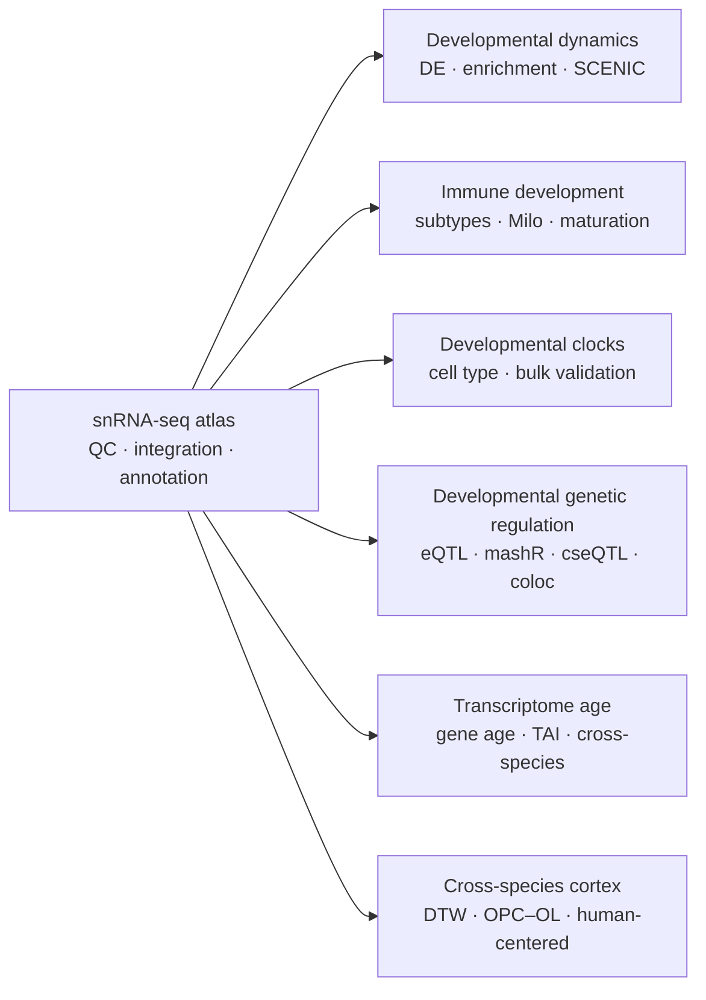

<div align="center">

# DevCellAtlas_Pigs

### A multi-tissue developmental single-nucleus transcriptomic atlas of the pig

*Analysis code accompanying a developmental atlas of* ***Sus scrofa*** *across tissues, cell types and developmental stages.*

[Overview](#overview) · [Code map](#code-map) · [Workflow](#analysis-workflow) · [Usage](#usage) · [Data](#data-availability) · [Reproducibility](#reproducibility) · [Citation](#citation)

</div>

---

## Overview

This repository contains the analysis and figure-generation code for a multi-tissue developmental single-nucleus RNA-sequencing study of the pig (*Sus scrofa*). The study follows transcriptional development from embryonic to postnatal life and integrates cell-atlas construction, developmental gene regulation, immune maturation, transcriptomic clocks, genetic regulation, transcriptome age and cross-species cortical development.

|  | Study design |
|---|---|
| **Developmental stages** | E55 · E90 · P0 · P30 · P90 · P180 |
| **Tissues** | Adipose · Cerebrum · Duodenum · Heart · Hypothalamus · Liver · Skeletal muscle |
| **Primary modality** | Single-nucleus RNA sequencing |
| **Main analysis modules** | Atlas · Developmental dynamics · Immune · Developmental clocks · eQTL · TAI · Cross-species |
| **Languages** | R · Python · Bash |

> **Scope.** This repository provides the publication analysis modules and figure-generation code. Large sequencing datasets and intermediate analysis objects are distributed separately through the data resources described in the manuscript.

---

## Analysis workflow



---

## Code map

| Module | Scope | Manuscript |
|---|---|---:|
| [`scripts/01_atlas_annotation/`](scripts/01_atlas_annotation/) | QC, AnnData construction, scVI integration, graph construction and atlas-level annotation | **Figure 1** |
| [`scripts/02_developmental_dynamics/`](scripts/02_developmental_dynamics/) | Adjacent-stage differential expression, enrichment, SCENIC and CSI modules | **Figure 2** |
| [`scripts/03_immune/`](scripts/03_immune/) | Immune-cell integration, subtype programs, maturation modeling and Milo | **Figure 3** |
| [`scripts/04_developmental_clock/`](scripts/04_developmental_clock/) | Cell-type-specific developmental clocks and bulk skeletal-muscle validation | **Figure 4** |
| [`scripts/05_bulk_eqtl/`](scripts/05_bulk_eqtl/) | Bulk eQTL, mashR, interaction eQTL, cell-type-resolved eQTL and colocalization | **Figure 5** |
| [`scripts/06_transcriptome_age/`](scripts/06_transcriptome_age/) | Gene-age assignment, pseudobulk expression and transcriptome age index analyses | **Figure 6** |
| [`scripts/07_cross_species/`](scripts/07_cross_species/) | Cross-species integration, stage alignment, OPC–OL trajectories and human-centered comparisons | **Figure 7** |
| [`figures/`](figures/) | Main and supplementary figure-generation scripts | Figures & Supplementary Figures |
| [`environment/`](environment/) | Software dependencies and path configuration | — |
| [`docs/`](docs/) | Script provenance and release metadata | — |

Scripts within each analysis directory are numbered in their intended logical or execution order where dependencies exist.

---

## Repository layout

```text
DevCellAtlas_Pigs/
├── scripts/
│   ├── 01_atlas_annotation/
│   ├── 02_developmental_dynamics/
│   ├── 03_immune/
│   ├── 04_developmental_clock/
│   ├── 05_bulk_eqtl/
│   ├── 06_transcriptome_age/
│   └── 07_cross_species/
├── figures/
├── environment/
├── docs/
├── REPRODUCIBILITY_NOTES.md
└── README.md
```

---

## Usage

The repository is organized as **analysis modules rather than a single end-to-end pipeline**. Most scripts begin from processed count matrices, metadata, genotype data or intermediate objects described in the manuscript.

Set the repository root:

```bash
export DEVPIGATLAS_ROOT=/path/to/DevCellAtlas_Pigs
```

Set the location of external datasets and large intermediate objects:

```bash
export DEVPIGATLAS_ANALYSIS_DIR=/path/to/analysis_data
```

Then run the scripts for the analysis module of interest in numerical order where dependencies exist.

<details>
<summary><strong>Recommended workflow</strong></summary>

1. Obtain or prepare the input data described in the manuscript.
2. Configure repository and analysis-data paths.
3. Install the software required for the selected module.
4. Run the numbered scripts within the corresponding analysis directory.
5. Use the associated scripts under `figures/` to reproduce manuscript visualizations.

Module-specific external programs and additional path variables are documented in [`environment/README.md`](environment/README.md).

</details>

---

## Software

Analyses were implemented in **R**, **Python** and **Bash** using domain-specific statistical and single-cell tools.

Major components include:

`Seurat` · `Scanpy` · `scVI-tools` · `pySCENIC` · `Milo` · `edgeR` · `glmnet` · `OmiGA` · `mashR` · `Bisque/bMIND` · `myTAI` · `CAMEX` · `Slingshot` · `GenEra` · `DIAMOND`

A software inventory is provided in [`environment/DEPENDENCIES.tsv`](environment/DEPENDENCIES.tsv). Versions are reported only where supported by the manuscript or retained environment records.

---

## Data availability

Raw sequencing data, processed datasets and large intermediate analysis objects are not stored in this repository.

Data accession information is provided in the accompanying manuscript and associated public repositories. Some analyses additionally require external reference resources, genome annotations, cisTarget databases or third-party QTL utilities.

See:

- [`environment/README.md`](environment/README.md) for software and path configuration
- [`REPRODUCIBILITY_NOTES.md`](REPRODUCIBILITY_NOTES.md) for analysis scope and reproducibility notes

---

## Figure generation

Scripts used to generate manuscript panels are provided under [`figures/`](figures/).

Final multi-panel figure assembly and graphical layout were performed separately from the analysis scripts.

---

## Reproducibility

The released code has been organized around the analyses reported in the manuscript and cleaned for public distribution. Repository-internal dependencies and static syntax were checked during release preparation.

Because the complete primary datasets and large intermediate objects are not bundled with the repository, this codebase should be viewed as a **transparent publication analysis resource**, rather than a one-command computational environment.

Script-level provenance and checksums are provided in [`docs/SOURCE_PROVENANCE.tsv`](docs/SOURCE_PROVENANCE.tsv).

---

## Citation

If you use this repository, please cite the accompanying manuscript.

> **Citation information will be updated upon publication.**

---

<div align="center">

**DevCellAtlas_Pigs**  
Developmental transcriptomics · single-nucleus RNA-seq · pig · cross-species genomics

</div>
